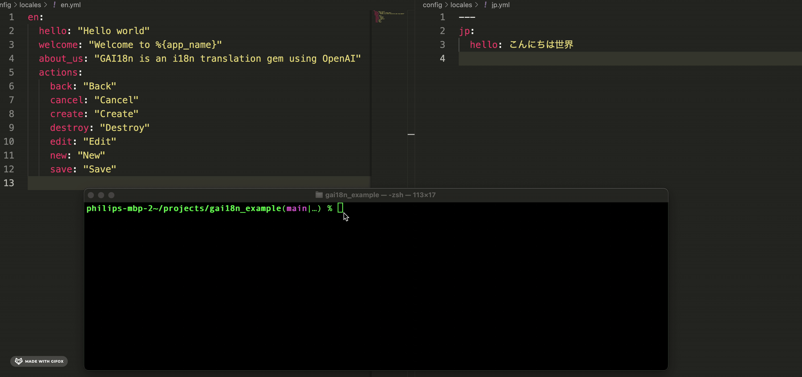

[](https://badge.fury.io/rb/gai18n)

# GAI18n

GAI18n uses OpenAI's Assistant API to translate source language files to target
language files. It is packaged as a gem and should work well in Rails or plain
Ruby applications.



## Setup

### Install the gem
Add this line to your application's Gemfile:

```ruby
gem 'gai18n'
```

Then install the gem by running the following command:
```bash
$ bundle install
```

### Initial Setup

Ensure you are in a Git repository, as the gem will require that you are
in a Git repository to work properly.

Please add the gai18n.rb configuration file. You can do this
by running the following command, `bundle exec gai18n setup`.

```bash
# generate the gai18n.rb configuration file. If you have a `config` directory,
# gai18n.rb file will be created in that directory. Otherwise, it will be
# created in the current project directory.
$ bundle exec gai18n setup


# Same as the above, but it will also set the OpenAI secret key in the file.
$ bundle exec gai18n setup -s your_openai_secret_key
```

Ensure the `gai18n.rb` configuration file is set up with your
`openai_secret_key`. Then you can run the following command to create an
Assistant in your OpenAI account and set the Assistant id in the configuration.

```bash
$ bundle exec gai18n assistant:create
```

Copy the Assistant id from the command's response and set it in the `gai18n.rb`
configuration file.

NOTE: Do not use an Assistant that was created separately. It must be created
by the `bundle exec gai18n assistant:create` command due to the unique
instructions required for the Assistant to work with this gem.

## Usage

To translate your source language file(s) to the target language file(s), run:

```ruby
$ bundle exec gai18n translate
```

This will translate the source language file(s) to the target language file(s)
and save the translated content in the target language file(s). The source
language file(s) will not be modified. The translated content will be merged
with the existing content in the target language file(s) or create a new
target language file(s) if it does not exist.

## Configuration

For all configuration options, please see the `gai18n.rb` file that was created
during the setup process. It contains annotations for each configuration option.

# Contributing

Bug reports and pull requests are welcome.

To get started:
- Fork the repository
- Clone the repository to your local machine
- cd into this directory and run `bundle install`
- Make your changes
- Run the tests with `bundle exec rake`
- Commit your changes
- Push your changes to your fork
- Open a pull request to this repository

# Code of Conduct

This project is intended to be a safe,
welcoming space for collaboration, and contributors are expected to adhere to the
[Contributor Covenant](https://www.contributor-covenant.org) code of conduct.

# License

The gem is available as open source under the terms of the [MIT License](https://opensource.org/licenses/MIT).
```
